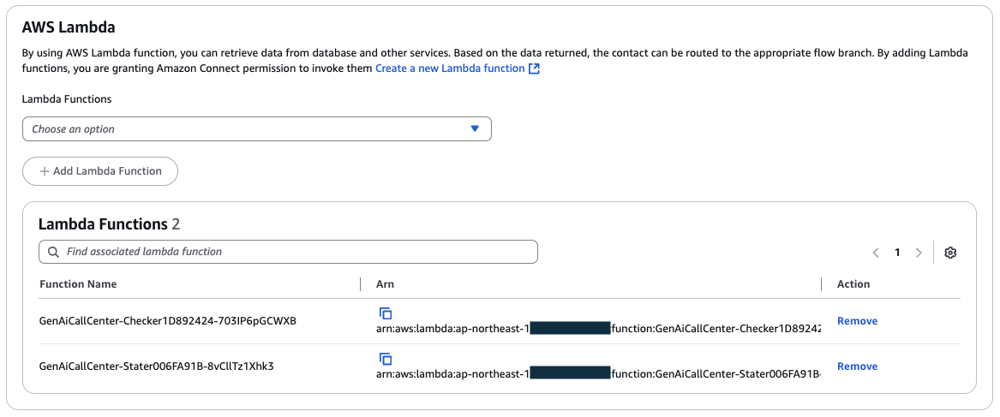
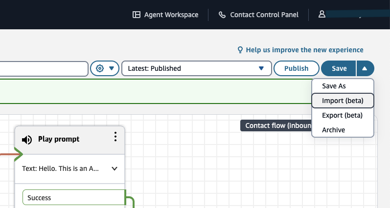
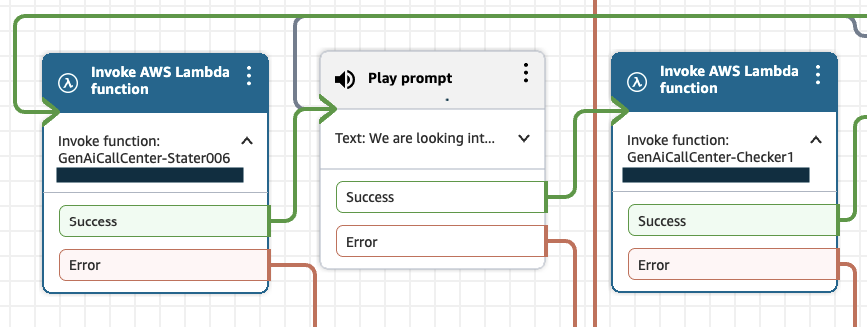

# Amazon Connect AI Bot Sample

[日本語のドキュメントはこちら](./README_ja.md)


This project is a sample project that builds an automated conversational bot using Amazon Bedrock and RAG in Amazon Connect flows.

## Prerequisites
To deploy this application, you need the following dependencies installed:

- Node.js (v18 or newer)
- Docker
- AWS CLI and IAM profile with Administrator policy

## Deployment
This deployment does not make any changes to Amazon Connect. Amazon Connect needs to be configured separately as described in the "Amazon Connect Configuration" section below.

### Changing Configuration
Open `bin/genai-call-center.ts` and set the deployment region. You can also deploy the two stacks to different regions.
Set `GenAiCallCenterStack` to the region where you use Amazon Connect.
```
new KnowledgeBaseStack(app, 'KnowledgeBase', {
  env: { account: process.env.CDK_DEFAULT_ACCOUNT, region: 'us-west-2' },
})

new GenAiCallCenterStack(app, 'GenAiCallCenter', {
  env: { account: process.env.CDK_DEFAULT_ACCOUNT, region: 'us-west-2' },
  knowledgeBaseRegion: 'us-west-2',
  knowledgeBaseId: 'YOUR_KNOWLEDGE_BASE_ID',
})
```

Open `./functions/bot/config.py` and configure as needed. If you are using a language other than English, at minimum you need to configure `LANGUAGE_CODE` and `GENERATING_PROMPT`.

### Installing Dependencies
First, install dependencies in both the root directory (where `cdk.json` is located) and in `./lib/custom-resources/oss-index`.
```
# From the root directory
npm install
cd ./lib/custom-resources/oss-index
npm install
# (Return to the root directory when finished)
cd -
```

### Bootstrap
For the first deployment only, bootstrap with the following command. If you are deploying to multiple regions, run bootstrap in all regions.
```
npx cdk bootstrap aws://<AWS Account ID>/<Region>
```

### Deploying the KnowledgeBase Stack
Deploy with the following command:
```
npx cdk deploy KnowledgeBase
```

After deployment, the ID of the created Knowledge Base will be displayed:
```
Outputs:
KnowledgeBase.KnowledgeBaseId = <Knowledge Base ID>
```

### Deploying the GenAICallCenter Stack
Open `bin/genai-call-center.ts` in an editor and change the `knowledgeBaseId` to the one displayed in the previous step.

```
new GenAiCallCenterStack(app, 'GenAiCallCenter', {
  env: { account: process.env.CDK_DEFAULT_ACCOUNT, region: 'ap-northeast-1' },
  knowledgeBaseRegion: 'us-west-2',
  knowledgeBaseId: '<Knowledge Base ID>',  # <= HERE
})
```

Deploy with the following command:

```
npx cdk deploy GenAiCallCenter
```

## Cleanup
You can delete the deployed resources with the following command:
```
npx cdk destroy --all
```

## Amazon Connect Configuration

Configure the following settings from the Amazon Connect page:

## Live Media Streaming Configuration

Enable `Live Media Streaming` from the `Data storage` page.
- Add any `Prefix` you like.
- Select `No data retention` for `Data retention period`.

## Configure Lambda Functions

From the `Flows` page, add functions that start with `GenAiCallCenter-Checker` and `GenAiCallCenter-Starter`.

## Import and Configure Flow

1. Open the Amazon Connect instance management screen and proceed to create a flow.
2. Select import from the menu in the upper right and import `./flows/flow_<language>.json`.


3. Configure the first Lambda invocation (left in the image) to call `GenAiCallCenter-Starter` and the second Lambda invocation (right in the image) to call `GenAiCallCenter-Checker`. The values initially included are dummy values, so don't forget to change them.

# Data Source Configuration

## Upload Files
1. From the Amazon S3 screen, open the bucket whose name starts with `knowledgebase-datasourcebucket`.
2. Create a folder named `docs` using `Create folder`.
3. Upload the files contained in `./data/faq` to the `docs` folder.

## Sync Data Source

1. Open `genai-call-center` from the Amazon Bedrock Knowledge Bases page.
2. From the Data Source section, select `s3-data-source` and click Sync.

## Automatic File Sync
If you add or change files in S3, you need to sync again.
For information on how to automatically sync periodically, see [How do I automatically sync data to Amazon Bedrock?](https://repost.aws/knowledge-center/bedrock-automatically-sync-data).
