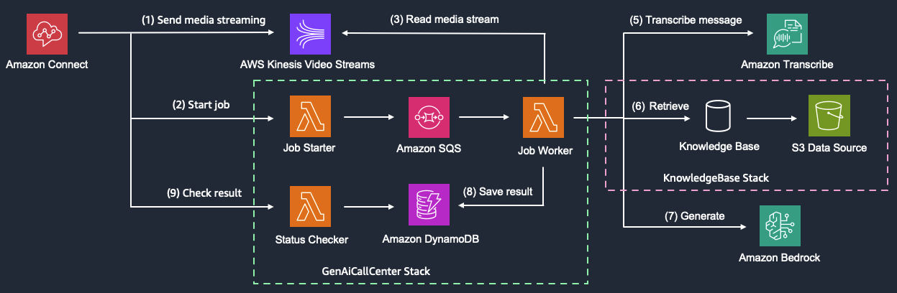
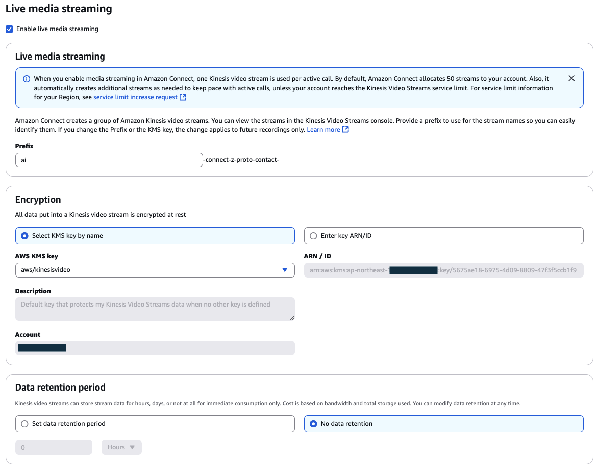
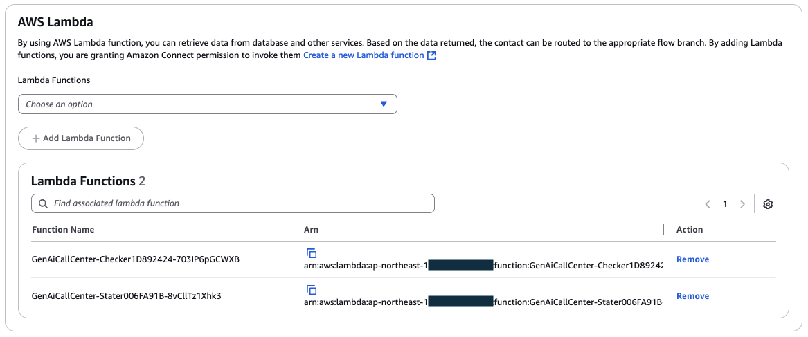
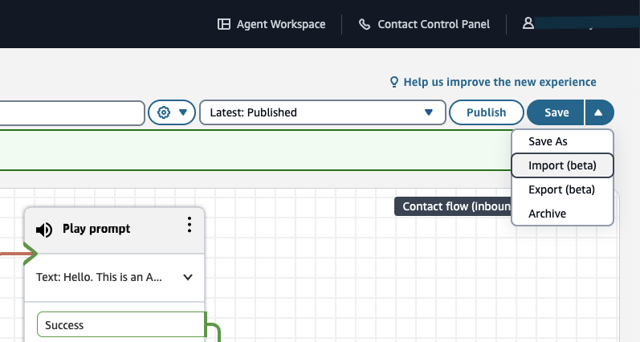
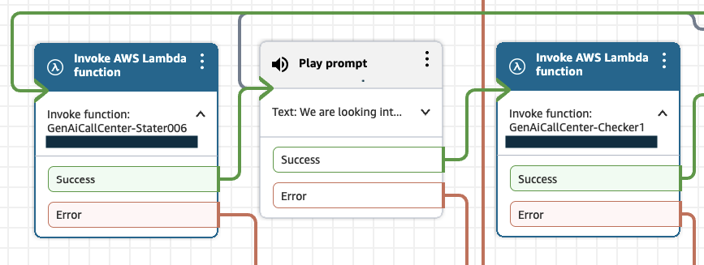
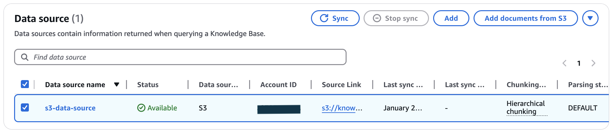

# Amazon Connect AI Bot Sample



このプロジェクトは、Amazon Connect フローで Amazon Bedrock と RAG を使用した自動対話ボットを構築するサンプルプロジェクトです。


## 前提条件
このアプリをデプロイするには、以下の依存関係がインストールされている必要があります：

- Node.js (v18 or newer)
- Docker
- AWS CLI and IAM profile with Administrator policy

## デプロイ
このデプロイでは Amazon Connect に対する変更は行われません。Amazon Connect については後述の `Amazon Connect の設定` で別途設定します。

### 設定の変更
`bin/genai-call-center.ts` を開き、デプロイ先のリージョンを設定します。2つのスタックを別のリージョンにデプロイすることもできます。
`GenAiCallCenterStack` は Amazon Connect を利用するリージョンに設定して下さい。
```
new KnowledgeBaseStack(app, 'KnowledgeBase', {
  env: { account: process.env.CDK_DEFAULT_ACCOUNT, region: 'us-west-2' },
})

new GenAiCallCenterStack(app, 'GenAiCallCenter', {
  env: { account: process.env.CDK_DEFAULT_ACCOUNT, region: 'us-west-2' },
  knowledgeBaseRegion: 'us-west-2',
  knowledgeBaseId: 'YOUR_KNOWLEDGE_BASE_ID',
})
```

`./functions/bot/config.py` を開き、必要に応じて設定を行います。英語以外の言語を使用する場合は、最低限 `LANGUAGE_CODE` と `GENERATING_PROMPT` の設定が必要です。

### 依存モジュールのインストール
まず、ルートディレクトリ (`cdk.json` のあるディレクトリ) と、`./lib/custom-resources/oss-index` でそれぞれ依存モジュールをインストールします。
```
# ルートディレクトリから
npm install
cd ./lib/custom-resources/oss-index
npm install
# (終わったらルートディレクトリに戻っておく)
cd -
```

### ブートストラップ
初回デプロイ時のみ以下のコマンドでブートストラップを行います。複数のリージョンにデプロイを行う場合は、全てのリージョンでブートストラップを実行します。
```
npx cdk bootstrap aws://<AWS アカウント ID>/<リージョン>
```

### KnowledgeBase スタックのデプロイ
以下のコマンドでデプロイを行います。
```
npx cdk deploy KnowledgeBase
```

デプロイが終わると作成された Knowledge Base の ID が表示されます。
```
Outputs:
KnowledgeBase.KnowledgeBaseId = <Knowledge Base の ID>
```

### GenAICallCenter スタックのデプロイ
`bin/genai-call-center.ts` をエディターで開き、`knowledgeBaseId` を上記の手順で表示されたものに変更します。

```
new GenAiCallCenterStack(app, 'GenAiCallCenter', {
  env: { account: process.env.CDK_DEFAULT_ACCOUNT, region: 'ap-northeast-1' },
  knowledgeBaseRegion: 'us-west-2',
  knowledgeBaseId: '<Knowledge Base の ID>',  # <= HERE
})
```

以下のコマンドでデプロイを行います。

```
npx cdk deploy KnowledgeBase
```

## 削除
以下のコマンドでデプロイしたリソースを削除することができます。
```
npx cdk destroy --all
```

## Amazon Connect の設定

Amazon Connect のページから以下の設定を行います。

## Live Media Streaming の設定

`Data storage` のページから `Live Media Streaming` を有効にします。
- `Prefix` は好きなものを付けます。
- `Data retention period` は `No data retention` を選択します。

## 使用する Lambda 関数の設定

`Flows` のページから `GenAiCallCenter-Checker` と `GenAiCallCenter-Starter` から始まる関数を追加します。

## フローのインポートと設定

1. Amazon Connect のインスタンス管理画面を開き、フローの作成に進みます。
2. 右上のメニューからインポートを選択し、`./flows/flow_<言語>.json` をインポートします。


3. 1回目の Lambda 呼び出し (画像左) で `GenAiCallCenter-Starter`、2回目の Lambda 呼び出し (画像右) で `GenAiCallCenter-Checker` を呼び出すように設定します。最初から入っている値はダミーの値なので、変更を忘れないようにしてください。

# データソースの設定

## ファイルのアップロード
1. Amazon S3 の画面から、名前が `knowledgebase-datasourcebucket` から始まるバケットを開きます。
2. `Create folder` で `docs` という名前のフォルダを作ります。
3. `docs` フォルダに `./data/faq` に含まれるファイルをアップロードします。

## データソースの Sync

1. Amazon Bedrock Knowledge Bases のページから `genai-call-center` を開きます。
2. Data Source の項目から、`s3-data-source` を選択し、Sync をクリックします。

## ファイルの自動 Sync
S3 のファイルを追加・変更した場合には再度 Sync が必要です。
定期的に自動で Sync を行う方法については [データを Amazon Bedrock に自動的に同期させる方法を教えてください。](https://repost.aws/ja/knowledge-center/bedrock-automatically-sync-data) をご覧ください。
